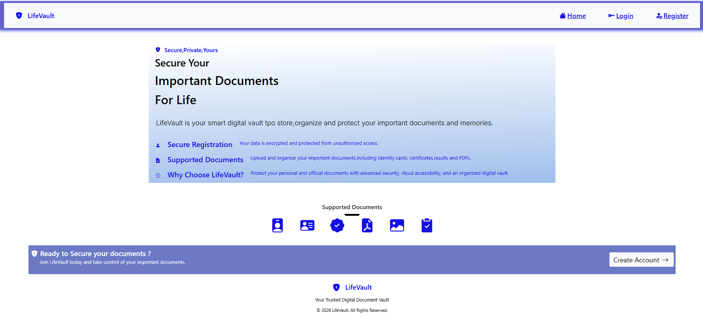
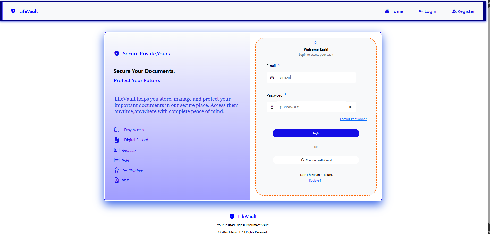
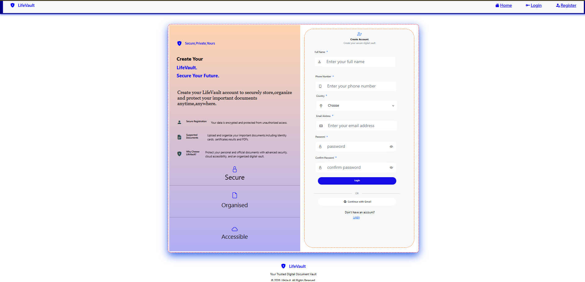
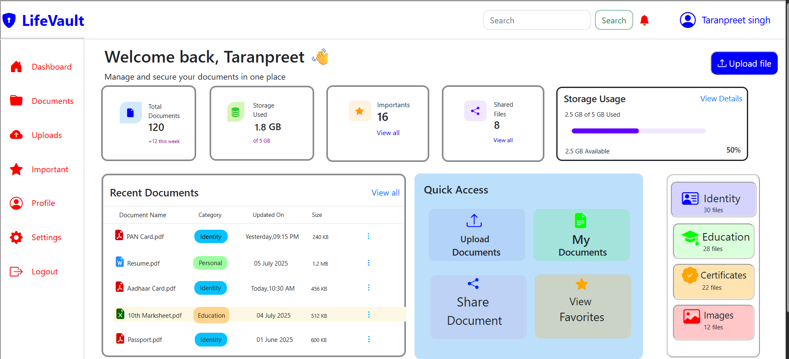

# 🔐 LifeVault

<p align="center">

A secure digital document management system built using **PHP CodeIgniter**, **MySQL**, **Bootstrap**, **HTML**, **CSS**, and **JavaScript**.

🚧 **Currently Under Development**

</p>

---

# 📖 About the Project

LifeVault is a secure web application that allows users to store, organize, and manage important digital documents in one place.

The objective of this project is to provide a simple, secure, and user-friendly document management system with authentication, categorized storage, and future AI-powered enhancements.

---

# 🚀 Tech Stack

| Technology | Used |
|------------|------|
| HTML5 | ✅ |
| CSS3 | ✅ |
| Bootstrap 5 | ✅ |
| JavaScript | ✅ |
| PHP | ✅ |
| CodeIgniter 3 | ✅ |
| MySQL | ✅ |


---

# 📸 Development Progress

## 🏠 Home Page



---

## 🔑 Login Page



---

## 📝 Registration Page



---

## 📊 Dashboard



---

## 📂 Documents Module

*(In Development)*

---

# ✨ Planned Features

- 🔐 User Authentication
- 📂 Document Categories
- 📤 Secure File Upload
- 🔍 Search Documents
- ⭐ Favorite Documents
- 🗑️ Trash Management
- 👤 User Profile
- ⚙️ Settings
- 📱 Responsive Design
- ☁️ Cloud Integration
- 🤖 AI Features (Future)

---

# 📁 Project Structure

```
LifeVault/
│
├── application/
├── assets/
├── system/
├── uploads/
├── Screenshots/
├── index.php
├── composer.json
└── README.md
```

---

# 🚧 Project Status

| Module | Status |
|---------|--------|
| Home UI | ✅ Completed |
| Login UI | ✅ Completed |
| Registration UI | ✅ Completed |
| Dashboard UI | ✅ Completed |
| Documents Module | 🚧 In Progress |
| Backend Development | 🚧 In Progress |
| Database Integration | 🚧 In Progress |
| Deployment | ⏳ Pending |

---

# 🎯 Future Enhancements

- AI-powered document search
- OCR for scanned documents
- Email notifications
- Secure document sharing
- Dark Mode
- Cloud Backup
- Multi-user support

---

# 🤝 Contributing

This project is currently under active development.

Suggestions and feedback are always welcome.

---

# ⭐ Support

If you like this project, consider giving it a ⭐ on GitHub.

---

<p align="center">

### 🚀 Building • Learning • Improving

*"Every commit is one step closer to a better developer."*

</p>